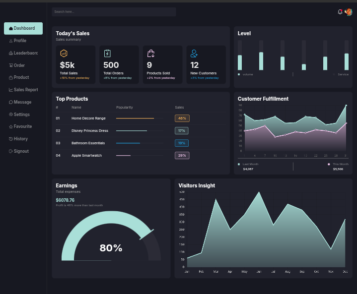
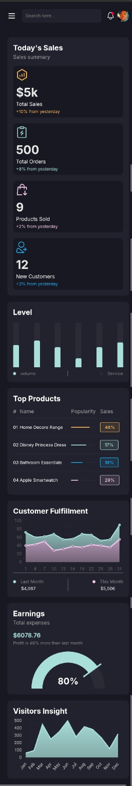

# E-Commerce Admin Dashboard
Welcome to the **E-Commerce Dashboard** project! This project provides a sleek and intuitive interface for managing various aspects of an e-commerce platform, including user profiles, product listings, orders, sales reports, and a leaderboard.





## Features

- **Dashboard:** Get an overview of your e-commerce activity, including sales, user engagement, and more.
- **Profile Management:** View user profiles.
- **Leaderboard:** Monitor top-performing users or products.
- **Order Management:** Easily track and manage orders.
- **Product Management:** Manage product listings and updates.
- **Sales Reports:** Generate and view sales reports.

## Technologies

- HTML5
- CSS3
- JavaScript (icons provided via SVG)

## Setup

1. Clone the repository:
   ```bash
   git clone https://github.com/chinonsochikelue/ecommerce-dashboard.git
